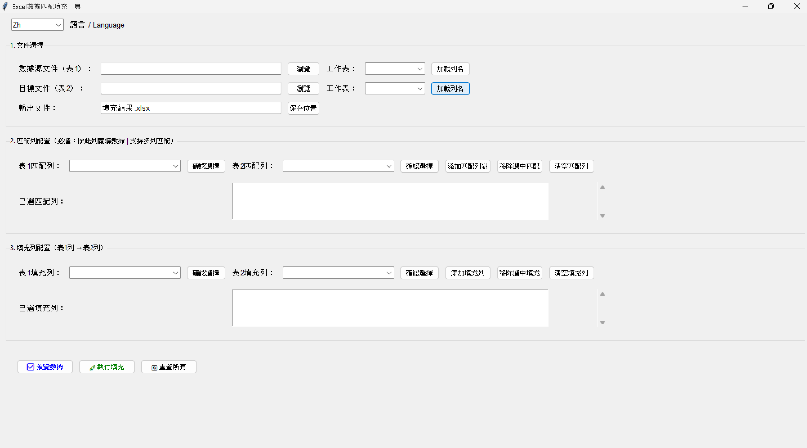
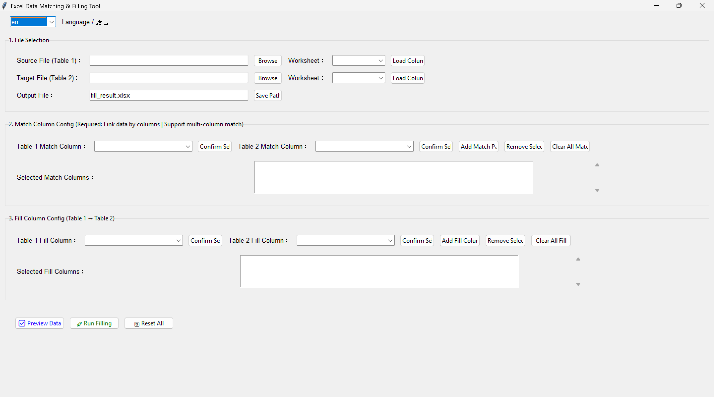

# Excel-Match-Filler

一款支援**多列聯合匹配**和繁中/英文雙語切換的Excel數據填充工具，無需編程基礎，點擊式操作即可完成數據匹配填充。  
A bilingual (Traditional Chinese/English) Excel data filling tool with multi-column joint matching support, no programming skills required, complete data matching and filling with click-based operations.

## 核心特性 / Core Features
✅ **多列匹配**：支援多組列聯合匹配（如訂單號+產品碼）  
✅ **雙語界面**：繁體中文/英文一鍵切換，适配不同語言用戶  
✅ **簡單易用**：直觀的GUI界面，無需編程基礎  
✅ **數據預覽**：填充前預覽結果，減少操作錯誤  
✅ **穩定可靠**：完善的錯誤提示和防錯機制  

## 快速開始 / Quick Start
### 方式1：下載EXE（推薦） / Download EXE (Recommended)
前往 [Releases](https://github.com/mickyleung/Excel-Match-Filler/releases) 下載打包好的EXE文件，雙擊即可運行（無需安裝Python）。  
Go to [Releases](https://github.com/mickyleung/Excel-Match-Filler/releases) to download the packaged EXE file, double-click to run (no Python installation required).

### 方式2：源碼運行 / Run from Source Code
```bash
# 克隆倉庫 / Clone repository
git clone https://github.com/mickyleung/Excel-Match-Filler.git
cd Excel-Match-Filler

# 安裝依賴 / Install dependencies
pip install -r src/requirements.txt -i https://pypi.tuna.tsinghua.edu.cn/simple

# 運行程式 / Run the program
python src/excel_matcher.py
```

### 方式3：手動打包 / Package Manually
```bash
cd src
pyinstaller -F -w --hidden-import openpyxl --hidden-import xlrd --name Excel數據匹配工具 excel_matcher.py
```

## 界面截圖 / Screenshots
### 繁體中文界面 / Traditional Chinese Interface


### 英文界面 / English Interface


## 使用說明 / User Guide
- 繁體中文：[docs/README_zh.md](docs/README_zh.md)
- English：[docs/README_en.md](docs/README_en.md)

## 依賴 / Dependencies
- Python 3.8+  
- pandas >= 1.5.0  
- openpyxl >= 3.0.0  
- xlrd >= 2.0.0  
- PyInstaller >= 5.0.0（僅打包時需要 / Only for packaging）

## 許可證 / License
本專案基於MIT許可證開源 - 詳見 [LICENSE](LICENSE)。  
This project is open source under the MIT License - see [LICENSE](LICENSE) for details.

## 貢獻 / Contribution
歡迎提交Issue反饋問題或建議新功能，也歡迎提交PR改進程式碼。  
Welcome to submit Issues to report problems or suggest new features, and submit PRs to improve the code.
